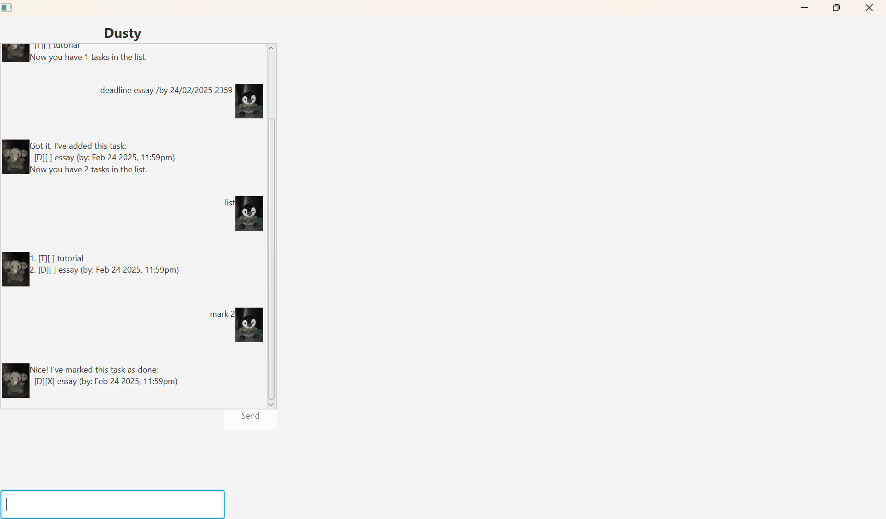

# Dusty User Guide

Dusty is a chat bot application built using JavaFX. It provides a simple user interface where users can input messages, and the chatbot responds accordingly. The application features a clean UI with a text input field, a send button, and a scrollable chat display area.

## Commands

Dusty supports the following commands:

bye: Exits the chatbot.

list: Displays all tasks.

mark [task number] : Marks a task as completed.

unmark [task number] : Marks a task as incomplete.

delete [task number] : Deletes a task from the list.

todo [task] #tag1 #tag2: Adds a new To-Do task with optional tags.

deadline [task]  /by <date/time> #tag1 #tag2: Adds a new Deadline task with a due date and optional tags.

event [task]  /from <date/time> /to <date/time> #tag1 #tag2: Adds a new Event task with a start and end time and optional tags.

find [keyword] : Searches for tasks containing the keyword.

findtag [tag] : Searches for tasks associated with a specific tag.

## How to Use

Open the application.

Type a command in the input field at the bottom.

Press Enter or click the Send button to submit your command.

The chatbot will respond accordingly.
